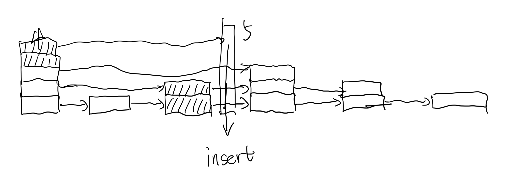

# SkipList

[](https://github.com/marsevilspirit/skiplist/actions/workflows/ci.yml)
[](LICENSE)
[](https://en.cppreference.com/w/cpp/17)
[](https://cmake.org/)

一个高效的跳表(Skip List)数据结构的C++实现，支持快速的插入、删除和搜索操作。

## ✨ 特性

- 🚀 平均时间复杂度 O(log n) 的插入、删除、搜索
- 🔒 **线程安全**：使用读写锁（Read-Write Lock）保证并发安全
- 📦 模板化设计，支持任意键值类型
- 🧪 完整的单元测试覆盖，包括并发测试
- 🔧 现代CMake构建系统
- 📚 详细的使用示例和性能测试

## 🚀 快速开始

### 构建项目

```bash
# 克隆项目
git clone https://github.com/marsevilspirit/skiplist
cd skiplist

# 创建构建目录
mkdir build && cd build

# 配置项目
cmake ..

# 编译
make -j$(nproc)
```

### 运行示例

```bash
# 在build目录中运行演示程序
./skiplist_example
```

### 运行测试

```bash
# 方法1：直接运行测试程序
./skiplist_tests

# 方法2：使用CTest
ctest --verbose

# 方法3：只运行特定测试
./skiplist_tests --gtest_filter="SkipListTest.InsertAndSearch"
```

## 📖 使用方法

### 基本使用
```cpp
#include "skiplist.hpp"

// 创建线程安全的跳表
skiplist::SkipList<int, std::string> sl(16);  // 最大层数16

// 插入数据
sl.insert(5, "five");
sl.insert(10, "ten");

// 搜索
auto node = sl.search(5);
if (node) {
    std::cout << "Found: " << node->value << std::endl;
}

// 删除
sl.remove(5);

// 显示结构
sl.display();
```

### 并发安全使用
```cpp
#include <thread>

// 多线程安全使用
std::thread t1([&sl]() {
    sl.insert(1, "one");
    sl.insert(2, "two");
});

std::thread t2([&sl]() {
    auto node = sl.search(1);  // 可以与其他读操作并发
    if (node) {
        std::cout << "Found: " << node->value << std::endl;
    }
});

t1.join();
t2.join();
```

## 🏗️ 构建选项

```bash
# Debug构建
cmake -DCMAKE_BUILD_TYPE=Debug ..

# 禁用测试
cmake -DBUILD_TESTS=OFF ..

# 生成编译数据库（用于IDE支持）
cmake -DCMAKE_EXPORT_COMPILE_COMMANDS=ON ..
```

## 📋 TODO

- [x] 添加 gtest 测试
- [x] 实现并发安全（读写锁）
- [x] 添加性能基准测试
- [ ] 支持迭代器接口
- [ ] 细粒度锁优化

## 📊 算法原理

### 并发安全设计
本项目使用读写锁（Read-Write Lock）实现线程安全：

- **写操作**（插入、删除）：使用独占锁，保证数据一致性
- **读操作**（搜索、显示）：使用共享锁，允许多个线程并发读取
- **性能特点**：读多写少的场景下性能优异

### insert原理



